# 暖伴 - 糖尿病陪伴应用交互流程图

## 产品概述
**产品名称：** 暖伴  
**产品定位：** 专为老年人设计的糖尿病陪伴应用  
**设计风格：** 暖橙色主题（#FF8A00/#FFC24B）、适老化大字体、iOS风格磨砂玻璃设计  
**核心功能：** AI专家咨询、课程讲解、健康管理

---

## 一、整体架构流程

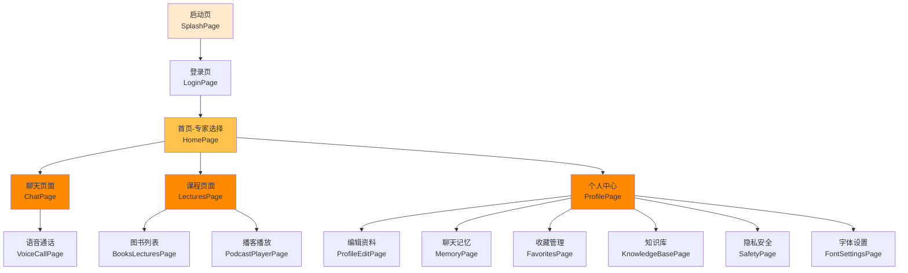

---

## 二、详细页面流程

### 2.1 启动与登录流程

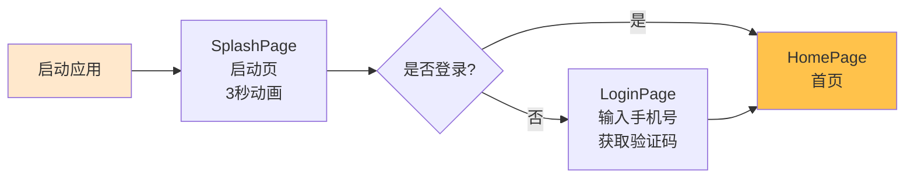

**页面说明：**
- **启动页**：品牌展示，3秒后自动跳转
- **登录页**：手机号验证码登录，适老化大字体，清晰的输入提示

---

### 2.2 首页-专家选择流程

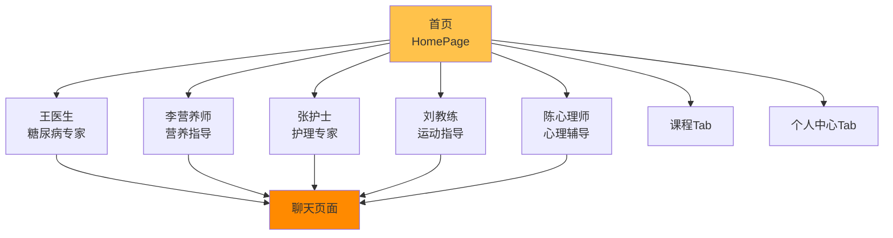

**功能说明：**
- 5位AI专家，不同专业领域
- 专家卡片展示：头像、姓名、职称、擅长领域、最近聊天内容
- 底部Tab导航：首页、课程、个人中心

---

### 2.3 聊天交互流程

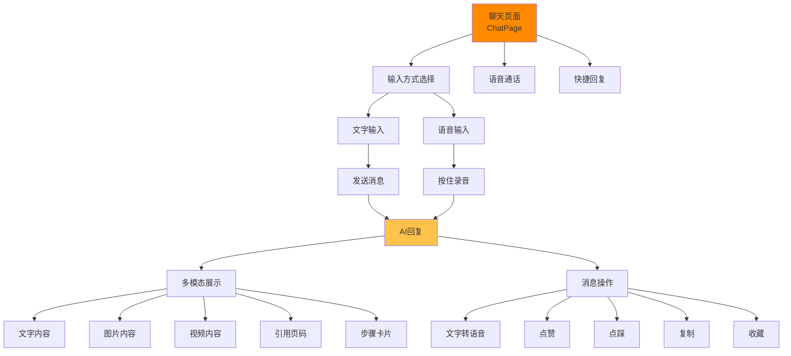

**交互说明：**
- **输入方式**：文字输入、语音录音（长按）
- **AI回复**：多模态内容（文字、图片、视频、引用、步骤卡片）
- **消息操作**：朗读、点赞、点踩、复制、收藏
- **快捷功能**：语音通话、快捷回复建议

---

### 2.4 语音通话流程

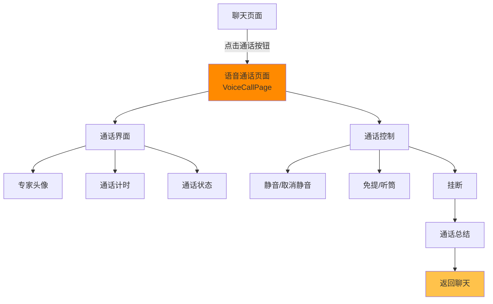

**功能说明：**
- 实时语音通话界面
- 通话计时、状态显示
- 静音、免提、挂断控制
- 通话结束后生成总结

---

### 2.5 课程讲解流程

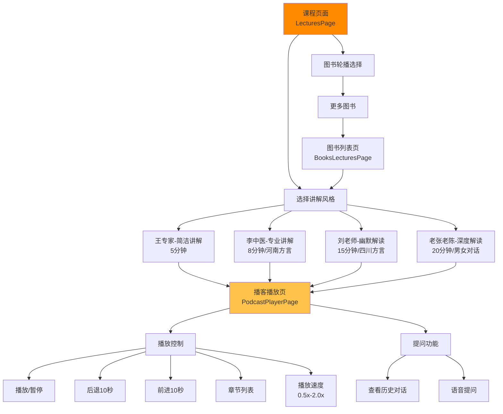

**功能说明：**
- **图书选择**：轮播展示，支持左右切换
- **讲解风格**：4种风格，不同时长和方言
- **播放控制**：播放/暂停、快进后退、章节跳转、倍速播放
- **互动功能**：随时提问、查看历史对话

---

### 2.6 个人中心流程

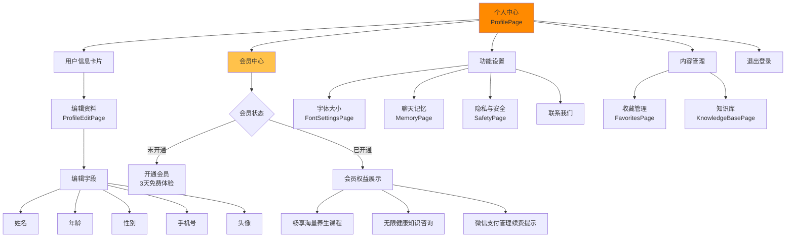

**功能说明：**
- **用户信息**：头像、姓名、年龄、性别、手机号，可编辑
- **会员中心**：开通会员、查看权益、管理订阅
- **功能设置**：字体大小、聊天记忆、隐私安全
- **内容管理**：收藏、知识库

---

### 2.7 聊天记忆管理流程

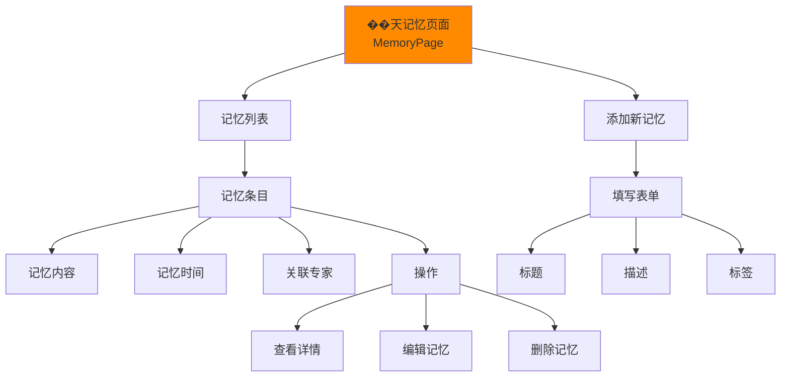

**功能说明：**
- AI自动记录用户健康信息
- 手动添加、编辑、删除记忆
- 按时间、专家分类显示

---

### 2.8 收藏管理流程

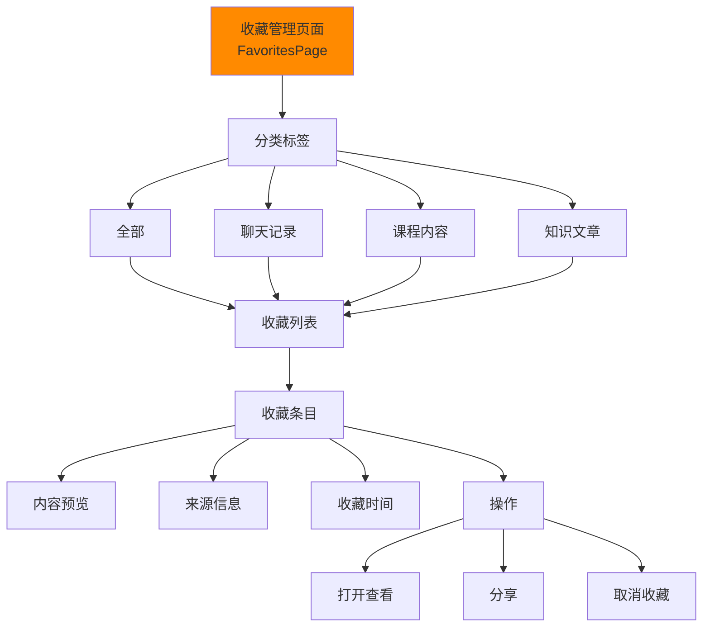

**功能说明：**
- 多类型收藏：聊天、课程、知识
- 分类浏览、搜索
- 打开查看、分享、取消收藏

---

### 2.9 知识库流程

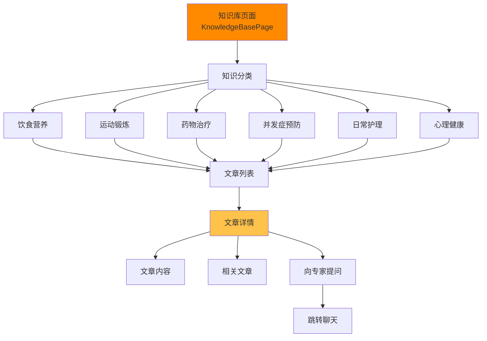

**功能说明：**
- 按分类浏览健康知识
- 文章详情展示
- 相关文章推荐
- 一键向专家提问

---

### 2.10 隐私与安全流程

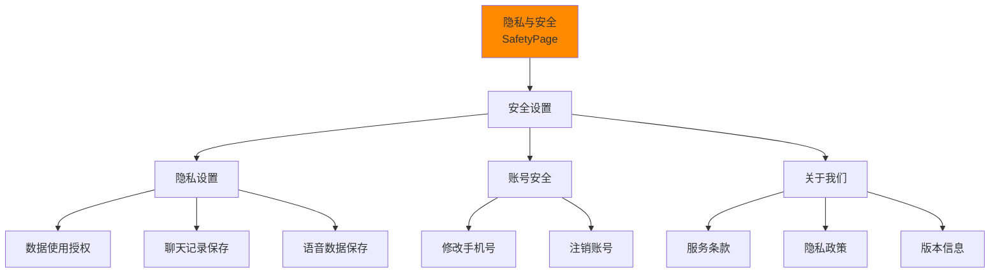

**功能说明：**
- 数据使用授权管理
- 账号安全设置
- 服务条款和隐私政策

---

## 三、核心交互特性

### 3.1 多模态交互
- **文字输入**：大字体键盘，清晰易读
- **语音输入**：长按录音，实时识别
- **语音通话**：实时语音对话
- **语音播放**：文字转语音、课程讲解

### 3.2 AI回复展示
- **文字内容**：分段显示，易读排版
- **图片内容**：配图说明，可放大查看
- **视频内容**：嵌入播放，清晰展示
- **引用页码**：书籍引用，可跳转查看
- **步骤卡片**：操作步骤，清晰指引

### 3.3 消息操作
- **文字转语音**：点击朗读，适合老年人
- **点赞/点踩**：反馈机制，优化AI
- **复制**：快速复制文字内容
- **收藏**：保存重要信息

### 3.4 课程交互
- **播放控制**：播放/暂停、快进后退
- **章节跳转**：快速定位内容
- **倍速播放**：0.5x-2.0x调节
- **实时提问**：随时向AI提问
- **历史对话**：查看问答记录

### 3.5 会员系统
- **免费体验**：3天免费试用
- **自动续费**：包月连续订阅
- **权益展示**：清晰的会员权益说明
- **微信支付**：在微信中管理订阅

---

## 四、底部导航栏（TabBar）

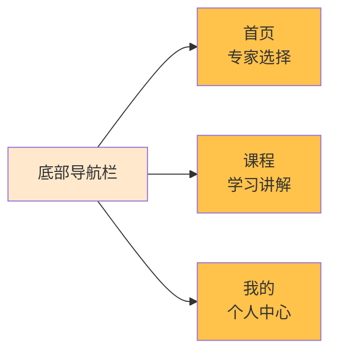

**导航说明：**
- 固定底部，全局可访问
- 大图标 + 文字标签
- 当前页面高亮显示

---

## 五、页面列表汇总

| 序号 | 页面名称 | 文件名 | 功能描述 |
|------|----------|--------|----------|
| 1 | 启动页 | SplashPage.tsx | 品牌展示，3秒后跳转 |
| 2 | 登录页 | LoginPage.tsx | 手机验证码登录 |
| 3 | 首页 | HomePage.tsx | 5位AI专家选择 |
| 4 | 聊天页 | ChatPage.tsx | 文字/语音聊天，多模态内容展示 |
| 5 | 语音通话页 | VoiceCallPage.tsx | 实时语音通话 |
| 6 | 课程页 | LecturesPage.tsx | 图书和讲解风格选择 |
| 7 | 图书列表页 | BooksLecturesPage.tsx | 所有图书展示 |
| 8 | 播客播放页 | PodcastPlayerPage.tsx | 课程播放和互动 |
| 9 | 个人中心 | ProfilePage.tsx | 用户信息和功能入口 |
| 10 | 编辑资料 | ProfileEditPage.tsx | 修改个人信息 |
| 11 | 聊天记忆 | MemoryPage.tsx | 健康信息记录管理 |
| 12 | 收藏管理 | FavoritesPage.tsx | 收藏内容管理 |
| 13 | 知识库 | KnowledgeBasePage.tsx | 健康知识浏览 |
| 14 | 隐私安全 | SafetyPage.tsx | 隐私和安全设置 |
| 15 | 字体设置 | FontSettingsPage.tsx | 字体大小调节 |

---

## 六、设计规范

### 6.1 颜色系统
- **主色**：#FF8A00（暖橙色）
- **次色**：#FFC24B（浅橙色）
- **背景渐变**：from-[#FFF7EA] via-[#FFE8CC] to-[#FFD9B3]
- **文字**：深灰色、灰色（muted-foreground）

### 6.2 字体规范
- **大标题**：text-2xl（24px）
- **标题**：text-xl（20px）
- **正文**：text-base（16px）
- **辅助文字**：text-sm（14px）
- **小字**：text-xs（12px）

### 6.3 组件规范
- **圆角**：rounded-2xl（16px）、rounded-3xl（24px）
- **阴影**：shadow-lg、shadow-xl、shadow-2xl
- **间距**：p-4、p-5、p-6、gap-3、gap-4、gap-5
- **磨砂效果**：glass-card、glass-button、glass-header、glass-primary

### 6.4 适老化设计
- **大字体**：最小16px，重要内容20px以上
- **高对比度**：文字与背景对比度≥4.5:1
- **大按钮**：最小点击区域48x48px
- **清晰图标**：6x6（24px）以上
- **简化操作**：减少点击层级，一键直达

---

## 七、技术实现

### 7.1 前端技术栈
- **框架**：React 18
- **路由**：React Router v7
- **样式**：Tailwind CSS v4
- **图标**：Lucide React
- **类型**：TypeScript

### 7.2 状态管理
- **本地状态**：useState、useEffect
- **路由参数**：useParams、useNavigate
- **数据模拟**：experts.ts（专家数据）

### 7.3 关键功能实现
- **多模态展示**：条件渲染，支持文字、图片、视频、引用、步骤
- **语音录音**：长按录音，实时反馈
- **播放控制**：自定义播放器，支持章节、倍速、快进后退
- **会员系统**：状态管理，弹窗展示

---

## 八、用户场景示例

### 场景1：新用户首次使用
1. 打开应用 → 启动页（3秒）
2. 进入登录页 → 输入手机号 → 获取验证码 → 登录
3. 进入首页 → 看到5位AI专家
4. 点击"王医生" → 进入聊天页
5. 输入"我早上血糖有点高" → AI回复建议
6. 点击"语音通话"按钮 → 与AI语音对话

### 场景2：老用户学习课程
1. 打开应用 → 自动登录 → 首页
2. 点击底部"课程"Tab → 课程页
3. 左右滑动选择《糖尿病饮食指南》
4. 点击"李中医-专业讲解" → 进入播放页
5. 播放课程 → 听到不懂的内容
6. 点击"提问"按钮 → 语音提问
7. AI回复解答 → 继续播放

### 场景3：查看聊天记忆
1. 首页 → 点击底部"我的"Tab → 个人中心
2. 点击"聊天记忆" → 查看健康记录
3. 看到"血糖监测记录" → 点击查看详情
4. 点击"向专家提问" → 跳转到聊天页

### 场景4：管理收藏内容
1. 个人中心 → 点击"收藏管理"
2. 切换到"课程内容"Tab
3. 看到收藏的课程列表
4. 点击某个课程 → 跳转到播放页
5. 继续学习

---

## 九、产品优势

### 9.1 适老化设计
- 大字体、高对比度
- 简化操作流程
- 语音交互为主
- 清晰的视觉反馈

### 9.2 专业性
- 5位专业AI专家
- 多种讲解风格（方言支持）
- 权威的健康知识库
- 个性化健康记忆

### 9.3 互动性
- 多模态交互（文字、语音、通话）
- 随时提问、实时解答
- 课程互动学习
- 反馈和收藏机制

### 9.4 人性化
- 温暖的色彩设计
- 亲切的专家形象
- 贴心的功能设置
- 隐私保护

---

## 十、后续迭代方向

### 10.1 功能增强
- 血糖数据记录与图表展示
- 用药提醒功能
- 健康报告生成
- 家人关联与监护

### 10.2 内容扩展
- 更多专业课程
- 社区交流功能
- 每日健康资讯
- 专家直播讲座

### 10.3 技术优化
- 语音识别准确率提升
- AI回复速度优化
- 离线内容支持
- 性能优化

---

## 文档版本
- **版本号**：v1.0
- **创建日期**：2026-01-22
- **更新日期**：2026-01-22
- **维护团队**：暖伴产品开发部门

---

**注意：本文档基于当前实现的13个核心页面和所有交互功能编写，供产品开发部门参考使用。**
